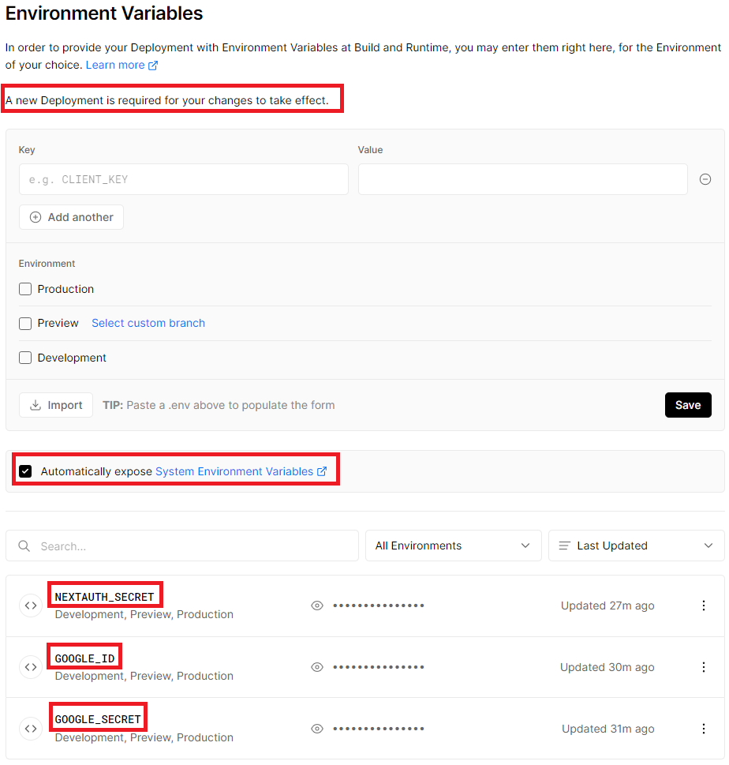

NextAuth.js is a complete open source authentication solution.

This is an example application that shows how `next-auth` is applied to a basic Next.js app.

The deployed version can be found at [authsandbox.vercel.app](https://authsandbox.vercel.app/)

## Getting Started

### 1. Clone the repository and install dependencies

```
git clone https://github.com/nextauthjs/next-auth-example.git
cd next-auth-example
npm install
```

### 2. Configure your local environment

Copy the .env.local.example file in this directory to .env.local (which will be ignored by Git):

```
cp .env.local.example .env.local
```
### 3. Configure Authentication Providers

For Google OAuth, visit: [https://console.cloud.google.com/apis/credentials](https://console.cloud.google.com/apis/credentials), add a new OAuth 2.0 Client under `OAuth 2.0 Client IDs` section, and make sure to have [http://localhost:3000/api/auth/callback/google](http://localhost:3000/api/auth/callback/google) as the `Authorized redirect URI` to have this running locally. You must also add any production URIs as well (i.e., [https://authsandbox.vercel.app/api/auth/callback/google](https://authsandbox.vercel.app/api/auth/callback/google)). 

While you are there, you need to copy both `Client ID` and `Client secrete` and update .env.local file (i.e., `GOOGLE_ID` = `Client ID`, `GOOGLE_SECRET` = `Client secrete`).

### 4. Start the application

To run your site locally, use:

```
npm run dev
```

To run it in production mode, use:

```
npm run build
npm run start
```

### 5. Preparing for Production

Follow the [Deployment documentation](https://next-auth.js.org/deployment). To support Vercel production, review the following list of settings. Notice that adding new env vars will not take effect without a new deployemnt (e.g., new commit to Github). 

Make sure to also visit [https://generate-secret.vercel.app/32](https://generate-secret.vercel.app/32) to get a randomly generated value that will be use dot set  `NEXTAUTH_SECRET`

Finally, make sure `Automatically expose System Environment Variables` is checked.



## Acknowledgements

This is a fork of https://github.com/nextauthjs/next-auth.

## License

ISC

